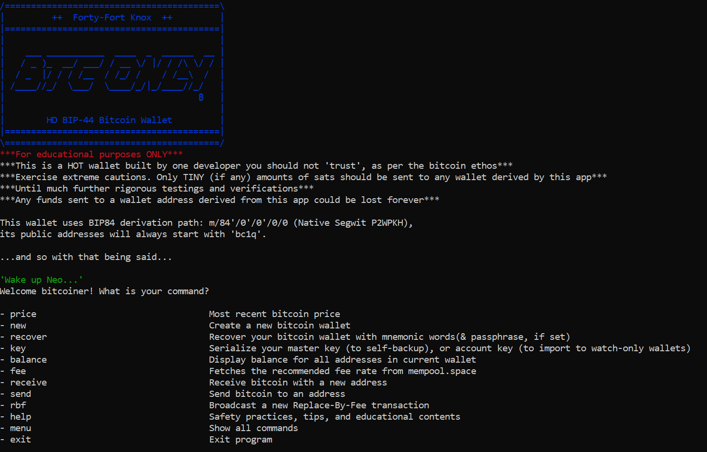

# Forty-Fort Knox Bitcoin Wallet



## Overview
**Forty-Fort Knox** is a lightweight, command-line Bitcoin wallet implemented in C, designed for secure and straightforward Bitcoin transaction management. It leverages **BIP-32**, **BIP-39** and **BIP-44** for hierarchical deterministic (HD) wallet generation, supports **P2WPKH (SegWit)** **BIP-141** **BIP-173** transactions, and integrates with public APIs for real-time blockchain data. The wallet prioritizes security using Libgcrypt for cryptographic operations and simplicity for educational purposes.

This project is under active development, currently supporting basic mainnet operations with plans for testnet support and advanced features like Replace-By-Fee (RBF), UTXO consolidations...etc

### <ins>IMPORTANT: FOR EDUCATIONAL PURPOSES ONLY</ins>
- This is a hot wallet built by one single developer, not yet tested and verified by peers.
- You should never **"TRUST"** any app or project without proof-of-work and verifications, as per the bitcoin ethos.
- Experiment with TINY amounts of sats at your own risk, note that **any funds sent to an address derived by this wallet could potentially be lost forever.**

## Features
- **HD Wallet Generation**: Creates BIP-32/BIP-44 compliant keys for mainnet Bech32 addresses (`bc1q...`).
- **Balance Checking**: Queries the Blockchain.com `multiaddr` API to display wallet balance.
- **UTXO Fetching**: Retrieves unspent transaction outputs (UTXOs) using the Blockchain.com `unspent` API, with address-based key matching.
- **Fee Estimation**: Fetches recommended fee rates from mempool.space’s API for cost-efficient transactions.
- **Transaction Building**: Constructs P2WPKH SegWit transactions with recipient and change outputs.
- **Transaction Signing**: Signs transactions using ECDSA on the secp256k1 curve via Libgcrypt.
- **Transaction Broadcasting**: Sends transactions to the Bitcoin network via Blockchain.com’s `pushtx` API.
- **Replace-By-Fee (RBF)**: Enables transaction replacement with sequence numbers < `0xffffffff`.
- **Secure Memory**: Uses Libgcrypt’s secure memory for private keys and sensitive data.
- **Address Usage Check**: Verifies if derived addresses have been used in transactions.

## Prerequisites
To build and run Fort Knox, you need the following:

- **Operating System**: Linux, macOS, or Windows (with MSYS2/Cygwin).
- **Dependencies**:
  - **Libgcrypt** (version ≥1.7.0): For cryptographic operations (ECDSA, SHA256, RIPEMD160).
  - **libcurl**: For making API requests to Blockchain.com and mempool.space.
  - **jansson**: For parsing JSON responses from APIs.
  - **libm**: For mathematical functions (e.g., `ceil`).
- **Tools**:
  - GCC or a compatible C compiler.
  - `pkg-config` for managing dependency flags.

### Installation
1. **Install Dependencies**:
   - On **Ubuntu/Debian**:
     ```bash
     sudo apt-get update
     sudo apt-get install libgcrypt20-dev pkg-config libcurl4-openssl-dev libjansson-dev
     ```
   - On **macOS** (using Homebrew):
     ```bash
     brew install libgcrypt curl jansson
     ```
   - On **Windows** (using MSYS2):
     ```bash
     pacman -S mingw-w64-x86_64-libgcrypt mingw-w64-x86_64-curl mingw-w64-x86_64-jansson
     ```

2. **Clone the Repository**:
   ```bash
   git clone https://github.com/BrinkOfSecondBailout/Fort_Knox.git
   cd fort_knox/src
   ```

3. **Compile the Wallet**:
   ```bash
   gcc -o knox knox.c crypt.c wallet.c mnemonic.c utxo.c hash.c query.c memory.c commands.c $(pkg-config --cflags --libs jansson libcurl libgcrypt) -lm
   ```
   or just use the Makefile already provided
   ```bash
   sudo make
   ```

## Usage
Run the wallet with:
```bash
./knox
```
## GCRYPT Note
Ensure you adjust #NEED_LIGCRYPT_VERSION to the newest up to date gcrypt version in "wallet.h"

The wallet operates via a command-line interface with the following commands:

- **`new`**: Generates a new HD wallet with a random seed.
- **`recover`**: Recovers a wallet from a seed phrase.
- **`balance`**: Displays the total balance across derived addresses.
- **`receive`**: Generate an unused address to receive bitcoin.
- **`fee`**: Fetches the recommended fee rate from mempool.space.
- **`send`**: Sends bitcoin to a recipient address, specifying amount and fee.
- **`rbf`**: Replace Replace-By-Fee enabled transaction in mempool.
- **`exit`**: Exits the program.

### Example Interaction
```bash
Command: new
Generated new wallet. Seed: <your_seed_phrase>
Command: balance
Available balance: 500000 satoshis (0.00500000 BTC)
Command: fee
Recommended fee rate: 40 sat/byte
Command: send
Enter recipient address: bc1qw508d6qejxtdg4y5r3zarvary0c5xw7kv8f3t4
Enter send amount in satoshis: 1000
Enter fee in satoshis: 200
Transaction sent successfully! Fee: 200 satoshis
Command: rbf
Enter transaction id: c6ec885618b657524ee69cbec422e6e2b048b8c278f13f0d415a4371ce4a2fcd
Successfully replaced old transaction with RBF!
Command: exit
```

## Technical Details
### Wallet Structure
- **HD Wallet**: Implements BIP-32 (HD wallets) and BIP-173 for Native Segwit addresses:
  - External chain: `m/84'/0'/0'/0/index` (for receiving funds).
  - Change chain: `m/84'/0'/0'/1/index` (for change outputs).
  - Uses a gap limit of 20 addresses to check for usage.
- **Address Type**: Supports P2WPKH (SegWit) with Bech32 addresses starting with `bc1q`.
- **Key Management**: Stores private and public keys in `key_pair_t` structs, using Libgcrypt’s secure memory (`gcry_malloc_secure`).

### Security Considerations
- **Private Keys**: Stored in secure memory (`gcry_malloc_secure`) and zeroed before freeing.
- **Rate Limiting**: Enforces a 20-second interval between API requests to comply with Blockchain.com and mempool.space limits.
- **Input Validation**: Extensive checks to prevent crashes or invalid transactions.
- **Dependencies**: Relies on well-tested libraries: Libgcrypt (crypto), libcurl (HTTP), jansson (JSON).

## Testing
- **Test Vectors**: Provided are test vectors in test_vectors.c, compile and run it to make sure the cryptographic calculations are correct.
### Running Tests
1. Compile the test file:
   ```bash
   gcc -o test_vectors test_vectors.c crypt.c mnemonic.c wallet.c utxo.c hash.c query.c memory.c commands.c $(pkg-config --cflags --libs libgcrypt jansson) -lm
   ```
   or just use the Makefile already provided
   ```bash
   sudo make test
   ```
2. Run the test:
   ```bash
   ./test_vectors
   ```

**Validate Transactions**: Use Bitcoin Core’s `testmempoolaccept` or an online decoder (e.g., blockstream.info) to verify transaction hex.

## Future Improvements
- **Testnet Integration**: Full support for testnet transactions and addresses.
- **Fee Caching**: Cache fee rates to reduce API calls.
- **GUI Interface**: Add a graphical interface for better user experience.
- **Multi-signature Support**: Implement P2WSH or other script types.
- **Serialization**: Persist wallet state (e.g., seed, child_key_count) to a file.
- **Lightning**: Layer 2 high speed transactions.

## Contributing
Contributions are welcome! To contribute:
1. Fork the repository.
2. Create a feature branch:
   ```bash
   git checkout -b feature-name
   ```
3. Commit your changes:
   ```bash
   git commit -m "Add feature"
   ```
4. Push to the branch:
   ```bash
   git push origin feature-name
   ```
5. Open a pull request on GitHub.

Please include tests and documentation for new features.

## License
This project is licensed under the MIT License. See the [LICENSE](LICENSE) file for details.

## Acknowledgments
- Inspired by Bitcoin Core and BIP-32/BIP-44 standards.
- Much gratitude to Greg Walker and Learnmeabitcoin.com.
- Powered by Blockchain.com and mempool.space APIs.
- Built with Libgcrypt, libcurl, and jansson for robust functionality.
